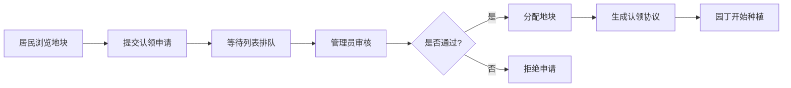
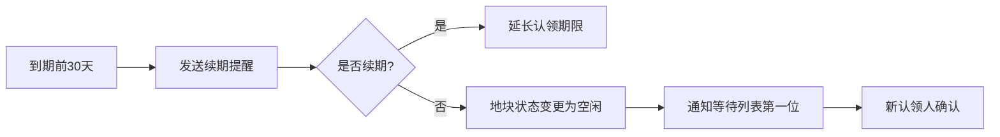

## 1. 产品概述

社区共享花园地块认领与管理平台，为城市社区提供数字化的花园管理解决方案。解决传统花园管理中信息不对称、流程繁琐、沟通成本高的问题，实现地块管理、认领审核、种植记录、费用缴纳等全流程在线化。

- 目标用户：社区花园管理方、居民园丁
- 核心价值：提升花园管理效率，促进社区交流，鼓励绿色生活方式

## 2. 核心功能

### 2.1 用户角色

| 角色 | 注册方式 | 核心权限 |
|------|---------|----------|
| 管理员 | 后台注册 | 地块管理、认领审核、公告发布、费用管理、用户管理 |
| 园丁（居民） | 自助注册 | 地块认领、种植日志、查看公告、分享种子、缴纳费用 |

### 2.2 功能模块

1. **首页**：花园概览、地块状态分布图、快捷入口
2. **地块管理**：管理员录入/编辑地块信息、状态管理
3. **认领申请**：居民在线申请、等待列表、管理员审核分配
4. **种植日志**：时间线展示、照片上传、种植/施肥/虫害记录
5. **公告板**：公共事务发布、维护排班、规则说明
6. **分享社区**：免费领取种子/幼苗、发布与浏览
7. **费用中心**：水电用量、账单生成、在线缴费
8. **续期管理**：到期提醒、自动续期、等待队列流转

### 2.3 页面详情

| 页面名称 | 模块名称 | 功能描述 |
|---------|---------|----------|
| 首页 | 数据概览 | 地块状态统计、公告摘要、待办提醒 |
| 首页 | 地块分布图 | 可视化展示所有地块状态，点击查看详情 |
| 地块列表 | 筛选搜索 | 按状态/面积/编号筛选地块 |
| 地块详情 | 基本信息 | 展示地块编号、面积、当前状态、历史认领记录 |
| 认领申请 | 申请表单 | 提交个人信息、认领意向、种植计划 |
| 认领审核 | 审核列表 | 管理员查看申请、分配地块、拒绝申请 |
| 种植日志 | 时间线 | 按时间倒序展示种植记录，支持照片查看 |
| 种植日志 | 发布日志 | 记录种植内容、施肥情况、虫害发现，上传照片 |
| 公告板 | 公告列表 | 展示所有公告，按类型分类 |
| 公告发布 | 编辑表单 | 管理员发布公告，设置类型和有效期 |
| 分享社区 | 帖子列表 | 浏览免费领取信息，按类别筛选 |
| 分享发布 | 发布表单 | 发布种子/幼苗分享信息，设置领取方式 |
| 费用中心 | 账单列表 | 查看历史账单、当前待缴费用 |
| 费用中心 | 在线缴费 | 模拟支付流程，标记账单已支付 |
| 续期提醒 | 提醒列表 | 展示即将到期的地块，一键续期 |
| 用户中心 | 个人信息 | 编辑个人资料、联系方式 |

## 3. 核心流程

### 3.1 地块认领流程

### 3.2 种植日志流程

### 3.3 费用缴纳流程

### 3.4 续期流程

## 4. 用户界面设计

### 4.1 设计风格

- **主色调**：自然绿色系（#2D6A4F 深绿、#40916C 中绿、#74C69D 浅绿），呼应花园主题
- **辅助色**：土壤棕色（#8B5A2B）、阳光黄（#F4D35E）
- **背景色**：米白色（#FAF8F5）营造温暖自然的氛围
- **按钮风格**：圆角矩形（8px），绿色渐变填充，hover时轻微上浮阴影
- **字体**：标题使用"Noto Serif SC"衬线字体体现自然质感，正文使用"Noto Sans SC"无衬线字体保证可读性
- **图标风格**：线性图标搭配自然元素（叶子、水滴、太阳、铲子等emoji）
- **布局风格**：卡片式布局，柔和阴影，适当留白

### 4.2 页面设计概述

| 页面名称 | 模块名称 | UI元素 |
|---------|---------|--------|
| 首页 | 数据概览 | 渐变背景统计卡片、图标化数据展示、微动效数字滚动 |
| 首页 | 地块分布图 | 网格化布局，不同颜色表示状态，hover放大效果 |
| 种植日志 | 时间线 | 垂直时间轴线，交替左右布局，照片卡片圆角阴影 |
| 公告板 | 公告卡片 | 分类标签色带，重要公告置顶标记 |
| 分享社区 | 分享卡片 | 网格布局，悬停效果，种子/幼苗图标标识 |
| 费用中心 | 账单卡片 | 状态色标（未付红色、已付绿色），金额突出显示 |

### 4.3 响应式设计

- **桌面优先**：1200px以上为最佳体验，采用多列布局
- **平板适配**：768-1199px，调整为双列或单列布局
- **手机适配**：768px以下，单列布局，底部导航栏，优化触摸交互
- **触摸优化**：按钮最小高度44px，足够的间距避免误触

### 4.4 动画与交互

- 页面加载时元素渐入动画，staggered延迟效果
- 卡片悬停时轻微上浮（translateY(-4px)），阴影加深
- 时间线滚动触发元素入场动画
- 提交/保存按钮加载状态动画
- 通知消息从右侧滑入，自动消失
- 地块状态切换时的颜色过渡动画
