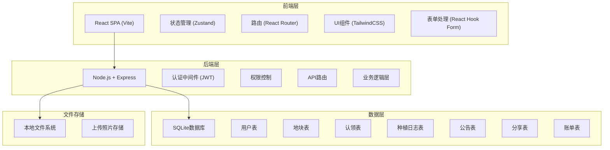
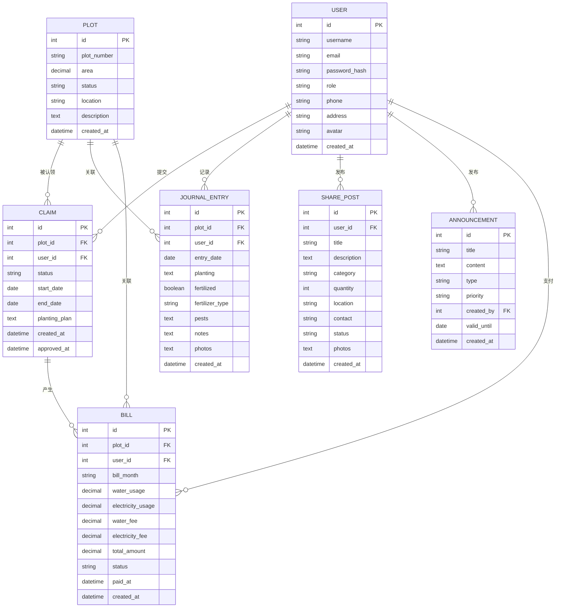

## 1. 架构设计



## 2. 技术说明

- **前端**：React@18 + TypeScript + TailwindCSS@3 + Vite
- **初始化工具**：Vite
- **后端**：Express@4 + TypeScript
- **数据库**：SQLite3（轻量级，无需额外安装，适合社区规模）
- **认证**：JWT Token
- **状态管理**：Zustand
- **表单**：React Hook Form + Zod
- **图片上传**：Multer
- **日期处理**：date-fns

## 3. 路由定义

| 路由路径 | 页面/用途 | 权限 |
|---------|---------|------|
| / | 首页概览 | 所有登录用户 |
| /plots | 地块列表 | 所有登录用户 |
| /plots/:id | 地块详情 | 所有登录用户 |
| /plots/manage | 地块管理（管理员） | 管理员 |
| /claims | 我的认领申请 | 所有登录用户 |
| /claims/review | 认领审核（管理员） | 管理员 |
| /journal | 种植日志列表 | 所有登录用户 |
| /journal/:plotId | 地块日志时间线 | 园丁/管理员 |
| /journal/new/:plotId | 新增种植日志 | 园丁 |
| /announcements | 公告板 | 所有登录用户 |
| /announcements/manage | 公告管理（管理员） | 管理员 |
| /share | 分享社区 | 所有登录用户 |
| /share/new | 发布分享 | 所有登录用户 |
| /bills | 费用中心 | 所有登录用户 |
| /bills/:id/pay | 账单缴费 | 园丁 |
| /renewal | 续期提醒 | 园丁/管理员 |
| /profile | 用户中心 | 所有登录用户 |
| /login | 登录页 | 公开 |
| /register | 注册页 | 公开 |

## 4. API 定义

### 4.1 类型定义

```typescript
// 用户
interface User {
  id: number;
  username: string;
  email: string;
  role: 'admin' | 'gardener';
  phone: string;
  address: string;
  avatar: string;
  createdAt: string;
}

// 地块
interface Plot {
  id: number;
  plotNumber: string;
  area: number;
  status: 'available' | 'claimed' | 'maintenance';
  location: string;
  description: string;
  createdAt: string;
}

// 认领
interface Claim {
  id: number;
  plotId: number;
  userId: number;
  status: 'pending' | 'approved' | 'rejected' | 'waiting';
  startDate: string;
  endDate: string;
  plantingPlan: string;
  createdAt: string;
  approvedAt: string;
}

// 种植日志
interface JournalEntry {
  id: number;
  plotId: number;
  userId: number;
  date: string;
  planting: string;
  fertilized: boolean;
  fertilizerType: string;
  pests: string;
  notes: string;
  photos: string[];
  createdAt: string;
}

// 公告
interface Announcement {
  id: number;
  title: string;
  content: string;
  type: 'maintenance' | 'rule' | 'event' | 'general';
  priority: 'normal' | 'important' | 'urgent';
  createdBy: number;
  validUntil: string;
  createdAt: string;
}

// 分享
interface SharePost {
  id: number;
  userId: number;
  title: string;
  description: string;
  category: 'seeds' | 'seedling' | 'tool' | 'other';
  quantity: number;
  location: string;
  contact: string;
  status: 'available' | 'reserved' | 'claimed';
  photos: string[];
  createdAt: string;
}

// 账单
interface Bill {
  id: number;
  plotId: number;
  userId: number;
  month: string;
  waterUsage: number;
  electricityUsage: number;
  waterFee: number;
  electricityFee: number;
  totalAmount: number;
  status: 'unpaid' | 'paid';
  paidAt: string;
  createdAt: string;
}
```

### 4.2 API 端点

| 方法 | 路径 | 说明 |
|-----|-----|-----|
| POST | /api/auth/login | 用户登录 |
| POST | /api/auth/register | 用户注册 |
| GET | /api/users/me | 获取当前用户信息 |
| GET | /api/plots | 获取地块列表 |
| GET | /api/plots/:id | 获取地块详情 |
| POST | /api/plots | 创建议题（管理员） |
| PUT | /api/plots/:id | 更新地块（管理员） |
| POST | /api/claims | 提交认领申请 |
| GET | /api/claims | 获取认领列表 |
| PUT | /api/claims/:id/approve | 审核通过（管理员） |
| PUT | /api/claims/:id/reject | 审核拒绝（管理员） |
| GET | /api/journal/:plotId | 获取地块日志 |
| POST | /api/journal | 发布种植日志 |
| GET | /api/announcements | 获取公告列表 |
| POST | /api/announcements | 发布公告（管理员） |
| GET | /api/shares | 获取分享列表 |
| POST | /api/shares | 发布分享 |
| GET | /api/bills | 获取账单列表 |
| PUT | /api/bills/:id/pay | 支付账单 |
| POST | /api/upload | 上传照片 |

## 5. 服务器架构


## 6. 数据模型

### 6.1 ER图



### 6.2 DDL 语句

```sql
-- 用户表
CREATE TABLE users (
    id INTEGER PRIMARY KEY AUTOINCREMENT,
    username VARCHAR(50) NOT NULL UNIQUE,
    email VARCHAR(100) NOT NULL UNIQUE,
    password_hash VARCHAR(255) NOT NULL,
    role VARCHAR(20) NOT NULL DEFAULT 'gardener',
    phone VARCHAR(20),
    address VARCHAR(255),
    avatar VARCHAR(255),
    created_at DATETIME DEFAULT CURRENT_TIMESTAMP
);

-- 地块表
CREATE TABLE plots (
    id INTEGER PRIMARY KEY AUTOINCREMENT,
    plot_number VARCHAR(20) NOT NULL UNIQUE,
    area DECIMAL(10,2) NOT NULL,
    status VARCHAR(20) NOT NULL DEFAULT 'available',
    location VARCHAR(255),
    description TEXT,
    created_at DATETIME DEFAULT CURRENT_TIMESTAMP
);

-- 认领表
CREATE TABLE claims (
    id INTEGER PRIMARY KEY AUTOINCREMENT,
    plot_id INTEGER NOT NULL,
    user_id INTEGER NOT NULL,
    status VARCHAR(20) NOT NULL DEFAULT 'pending',
    start_date DATE,
    end_date DATE,
    planting_plan TEXT,
    created_at DATETIME DEFAULT CURRENT_TIMESTAMP,
    approved_at DATETIME,
    FOREIGN KEY (plot_id) REFERENCES plots(id),
    FOREIGN KEY (user_id) REFERENCES users(id)
);

-- 种植日志表
CREATE TABLE journal_entries (
    id INTEGER PRIMARY KEY AUTOINCREMENT,
    plot_id INTEGER NOT NULL,
    user_id INTEGER NOT NULL,
    entry_date DATE NOT NULL,
    planting TEXT,
    fertilized BOOLEAN DEFAULT 0,
    fertilizer_type VARCHAR(100),
    pests TEXT,
    notes TEXT,
    photos TEXT,
    created_at DATETIME DEFAULT CURRENT_TIMESTAMP,
    FOREIGN KEY (plot_id) REFERENCES plots(id),
    FOREIGN KEY (user_id) REFERENCES users(id)
);

-- 公告表
CREATE TABLE announcements (
    id INTEGER PRIMARY KEY AUTOINCREMENT,
    title VARCHAR(255) NOT NULL,
    content TEXT NOT NULL,
    type VARCHAR(50) NOT NULL DEFAULT 'general',
    priority VARCHAR(20) NOT NULL DEFAULT 'normal',
    created_by INTEGER NOT NULL,
    valid_until DATE,
    created_at DATETIME DEFAULT CURRENT_TIMESTAMP,
    FOREIGN KEY (created_by) REFERENCES users(id)
);

-- 分享表
CREATE TABLE share_posts (
    id INTEGER PRIMARY KEY AUTOINCREMENT,
    user_id INTEGER NOT NULL,
    title VARCHAR(255) NOT NULL,
    description TEXT,
    category VARCHAR(50) NOT NULL,
    quantity INTEGER DEFAULT 1,
    location VARCHAR(255),
    contact VARCHAR(100),
    status VARCHAR(20) NOT NULL DEFAULT 'available',
    photos TEXT,
    created_at DATETIME DEFAULT CURRENT_TIMESTAMP,
    FOREIGN KEY (user_id) REFERENCES users(id)
);

-- 账单表
CREATE TABLE bills (
    id INTEGER PRIMARY KEY AUTOINCREMENT,
    plot_id INTEGER NOT NULL,
    user_id INTEGER NOT NULL,
    bill_month VARCHAR(7) NOT NULL,
    water_usage DECIMAL(10,2) DEFAULT 0,
    electricity_usage DECIMAL(10,2) DEFAULT 0,
    water_fee DECIMAL(10,2) DEFAULT 0,
    electricity_fee DECIMAL(10,2) DEFAULT 0,
    total_amount DECIMAL(10,2) NOT NULL,
    status VARCHAR(20) NOT NULL DEFAULT 'unpaid',
    paid_at DATETIME,
    created_at DATETIME DEFAULT CURRENT_TIMESTAMP,
    FOREIGN KEY (plot_id) REFERENCES plots(id),
    FOREIGN KEY (user_id) REFERENCES users(id),
    UNIQUE(plot_id, bill_month)
);

-- 初始数据
INSERT INTO users (username, email, password_hash, role, phone) VALUES 
('admin', 'admin@garden.com', '$2b$10$...', 'admin', '13800138000');
```
